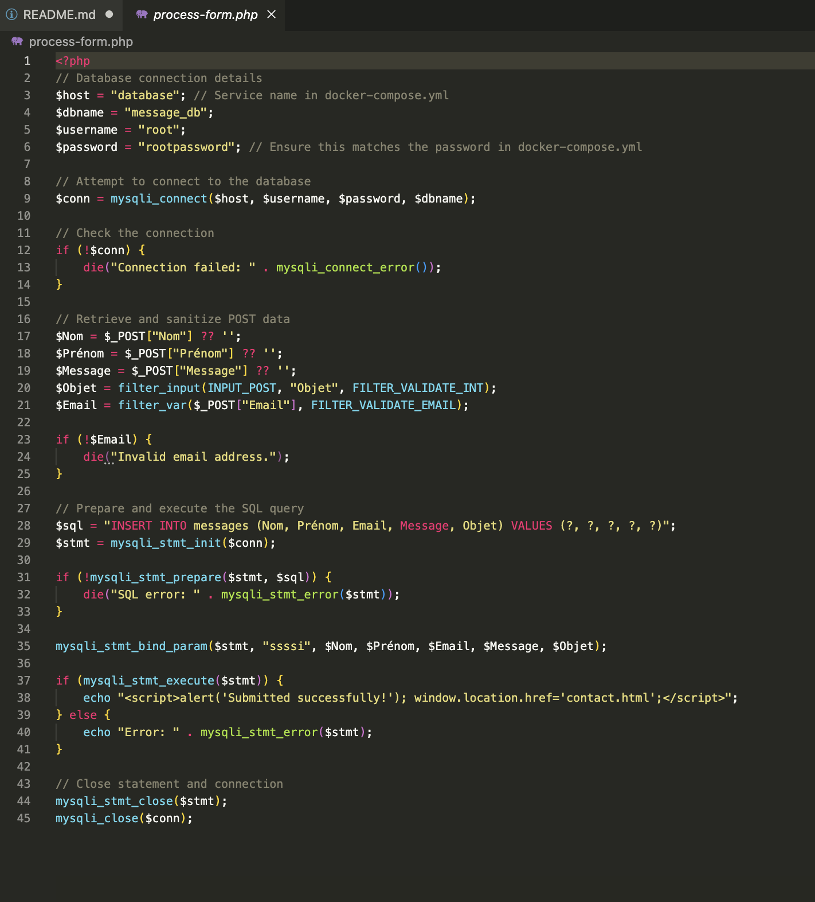
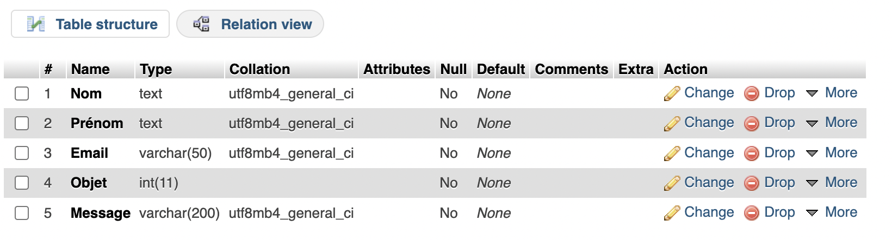
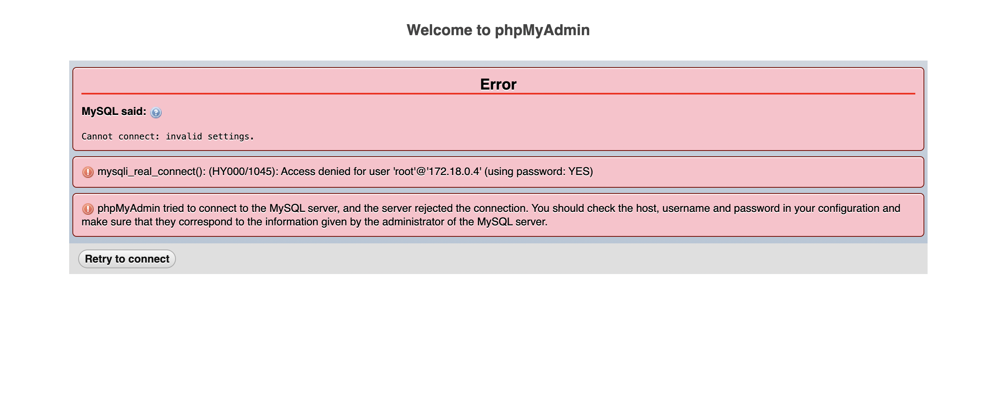
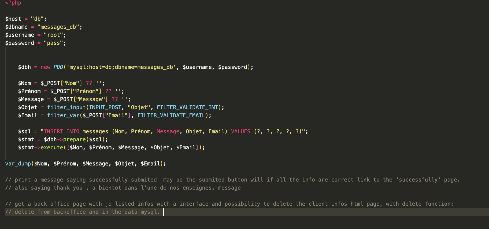
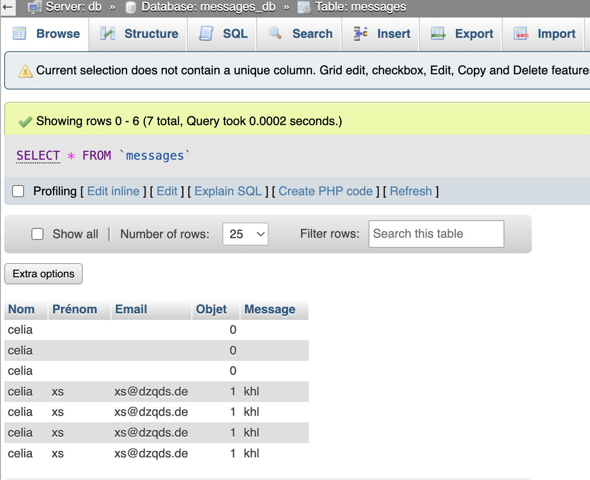
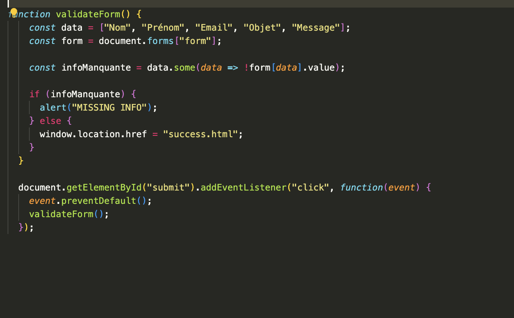
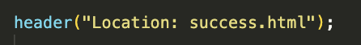

# restaurant_2.0.github.io

#### I cloned my restaurant repo and created an environment with it to open phpMyAdmin and create a table with different values (text, int, varchar, etc.) as presented in my HTML.

## First Step: Linking the Form to MySQL Database Using PHP

  About today : It looks like the connection issues between your PHP application and MySQL are persisting ... 

#### My PhP by the end of the day looks like this : 

#### My Table Looked like this : 

#### Now i'm gonna sleep on this : 

Tho, I might have found the answer in this video. We'll see tomorrow ...

https://www.youtube.com/watch?v=2ygog4MHXws&ab_channel=NouvelleTechno

## After two days of struggle, my database is finally connected to my form ! Yihaa. 

#### This is my PHP request who's posting my data onto phpmyadmin, filling rightfully my table. 

#### Now I will create a function with JS: 

##### addEventlistenner, if the form is submited correctly then the client get sent to the success.html page.

I had to add this line in my PHP file so it could display success.html and not my var_dump

##### Now I need an HTML page with an interface that displays a list of data and provides the ability to delete a client. Fetch the data from MySQL, and if a client is deleted, also remove it from phpMyAdmin.

1) Retrieve the table from MySQL
2) Create backoffice.html
3) Display the entries in the table on backoffice.html
4) If delete, send the information to MySQL to remove the row in phpMyAdmin as well